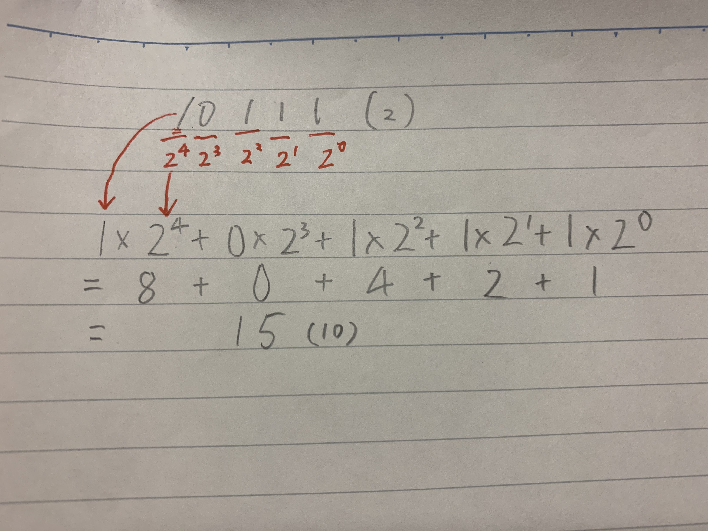
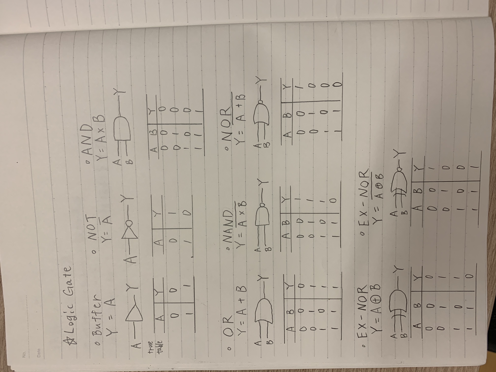
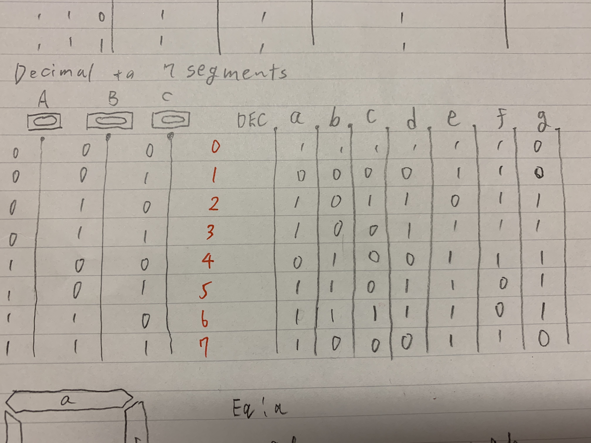
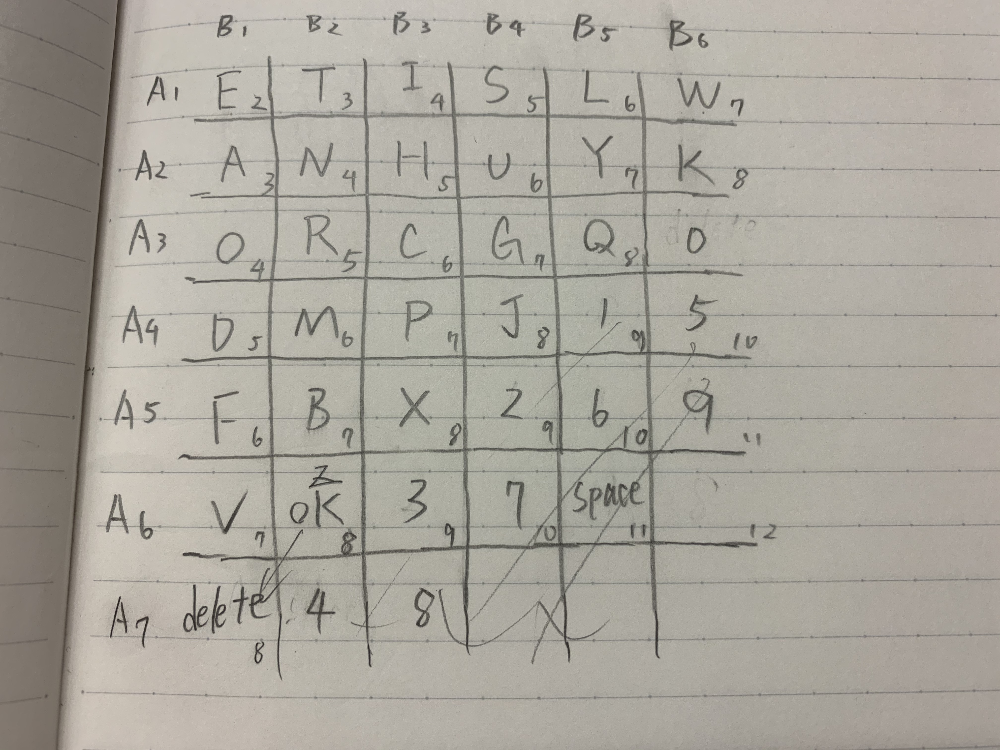

# Unit2-ComSci

### Evaluate and compare bash and arduino ###
Arduino can be worked by a program and apply it to actual circuit.
Comparing to bash, bash is mainly used to create an app or system in computer whereas arduino is mainly used to create a product with circuit such as mobile battery and temprature sensor.
Both programs are basically easy for begginers but arduino requires circuit.

**11/11 Reflection**
Today basically I learned how to make a code in Arduino. For example, how to use "void" and set the valuable.
I felt bit difficult to code because Arduino is more focused on applying on real circuit. 

``` int redLED = 13;```
define valuable redLED as 13 in Arduino

**11/13 Reflection**
Today I made the system which counts binary with LEDs in groups and I learned how to use %
And also I learned how to convert decimal to binary, binary to decimal as homework.
Steps shows how to convert binary to decimal


**11/17 Reflection**
Today I learned how to show the diagram of logicgate, make equation from the graph and make true table for them.  I felt this is one of the hardest topic that I have leaned in Comsci class so it took long time to understand how it works.


*CODE for OR gate*
```
int but1 = 13;
int but2 = 12;
int out1 = 3;
int out2 =4;

int stateA = 0, stateB =0,

void setup()
{
  pinmode(but1, INPUT);
  pinmode(but2, INPUT);
  pinmode(out1, OUTPUT);
  pinmode(out2, OUTPUT);
}
void loop()
{
  stateA = digitalRead(but1);
  stateB = digitalRead(but2);
  if(stateA || stateB){
    digitalWrite(out2, HIGH);
  }else{
    digitalWrite(out2, LOW);
  }
}
```
*CODE for EX-OR gate*
```
int but1 = 13;
int but2 = 12;
int out1 = 3;
int out2 = 4;

int state A =0, stateB = 0,

void setup()
{
  pinmode(but1, INPUT);
  pinmode(but2, INPUT);
  pinmode(out1, OUTPUT);
  pinmode(out2, OUTPUT);
}
void loop()
{
  stateA = digitalRead(but1);
  stateB = digitalRead(but2);
  if((!stateA && sttateB) || (stateA && stateB)){
    digitalWrite(out2, HIGH);
  }else{
    digitalWrite(out2, LOW);
  }
}
```
*CODE for EX-NOR*
```
int but1 = 13;
int but2 = 12;
int out1 = 3;
int out2 = 4;

int stateA = 0, stateB = 0,

void setup()
{
  pinmode(but1, INPUT);
  pinmode(but2, INPUT);
  pinmode(out1, OUTPUT);
  pinmode(out2, OUTPUT);
}
void loop()
{
  stateA = digitalRead(but1);
  stateB = digitalRead(but2);
  if((!stateA && !stateB) || (stateA && stateB)){
    digitalWrite(out1, HIGH);
  }else{
    digitalWrite(out1, LOW);
  }
}
```


**11/19 Reflection**
Today I worked on the system shows 0 to 7 with 7 LEDs in Arduino. And I finally got how true table and equation actually work.
I had a lot of fun making the system because the topic is really familiar with me and pretty easy to understand.
Table shows 7 segments converted from decimal


**11/20 Reflection**
Today I started off by watching a video about HCD. I didn't know that there are many kinds of design and there are many ways to make a good impacts on users.                    
**What is usability?**
The definition of "usability" is
```
Extent to which a product can be used
```
And also it should meet the standard which is ISO 9241-11

**what is HCD?**
```
HCD stands for "Human Centered Design" which means not making product based on itself or technology but 
rather making product based on the needs of users.

4 steps compose HCD Process
1. RESERCH
  Reserch the usage stats and clarify them
2. ANALYZE
  Analyze the needs of the users and clarify them
3. CREATE
  Create some solutions which meet their needs
4. EVALUATE
  Evaluate the solutions which made in third process 
```
**DISCOVERABILITY**
```
is a prime component when you make a good design. 
If the product interact with users, you have to consider "discoverablity". 
Discoverability is a design which is focused on making users aware of 
"what is happening", "what happened" and "what is able to be done"
```
**FEEDBACK**
```
FEEDBACK is a important factor of discoverability because 
it is a indicator to make users notice if it works as users did 
by giving some reactions.
```
**11/22 Reflection**
Today I started to work on the system which converts 2 buttons to English. And I came up with a idea that shows the table below. In order to make the system available, I need to know how to count how many times I pushed and create the table which contains a to z and number 1 to 9 and "delete" and "enter".

Basically, number which is on a vertical line shows times you pushed butA and number which is horizontal line shows times you pushed butB. For example, if you push butA twice and butB once, it shows "A"

I wrote the sample code Dr.Pinzon explained below for the table system
```
int col = 3;
int row = 3;
int indexRow = 0;
int indexCol = 0;
String keyboard[row][col] = {
  {"e", "t", "a"},
  {"0", "9", "x"},
  {"DL", "ST", "OK"}
}

void setup()
{
  pinmode(13, OUTPUT);
  Serial.begin(9600);
  attachInterruption(0, buttonApressed, RISING);
}

void loop()
{
Serial.println("Selected letter is: "+keyboard[indexRow][indexCol]);
}
//This function changes the row in the keyboard
void buttonApressed(){
  indexRow++;
//check for the max row number
if(indexRow>0){
  indexRow=0; //loop back to first row
  ```
 
 **11/25 Reflection**
 Today I learned variety of data types and how to convert hexadecimal to binary
 ```
 DATA TYPES
 char(8bit): signed number from -128 to 127
 unsigned char(8bit): unsigned number from 0 to 255
 int(16bit): signed number from -32768 to 32767
 unsigned int(16bit): unsigned number from 0 to 65535
 long(32bit): signed number from -2,147,483,648 to 2,147,483,647
 unsigned long(32bit): unsigned number from 0 to -4,294,967,295
 boolean(8bit): simple logical true/false
 float(32bit): signed number from -3.4028235E38 to 3.4028235E38
 ```
 **How to convert hexadecimal to binary**
 
  


