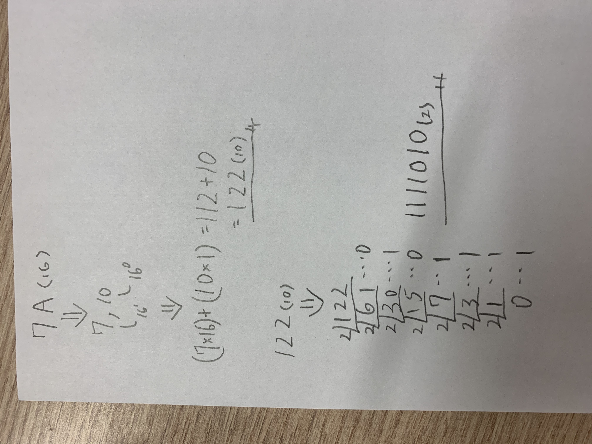
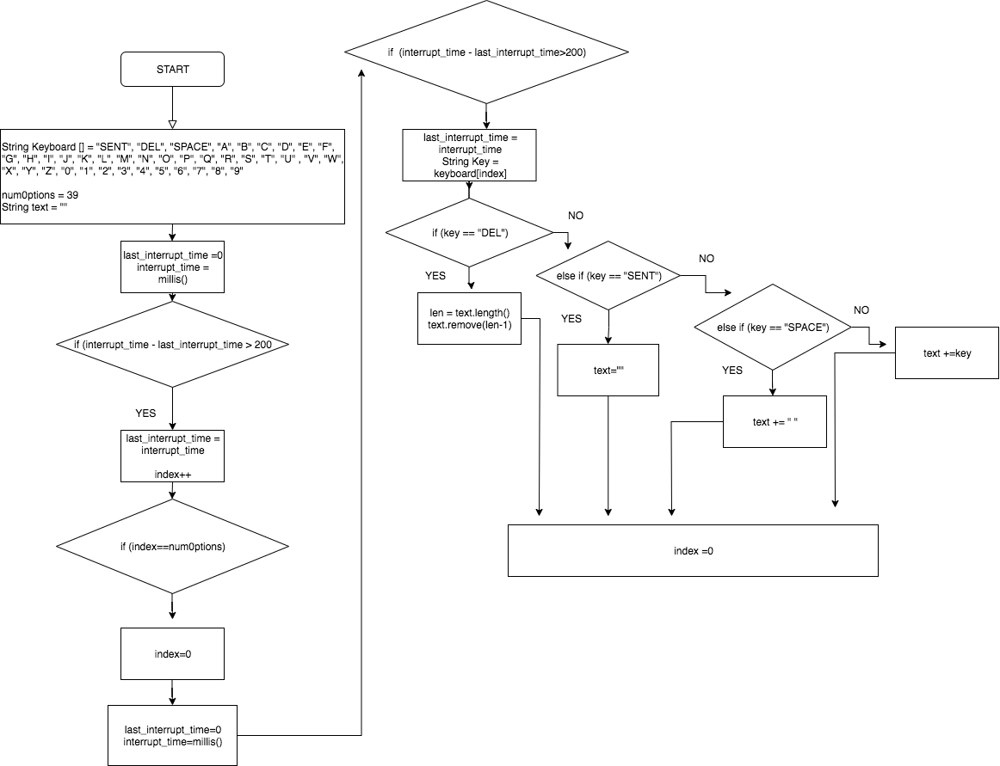
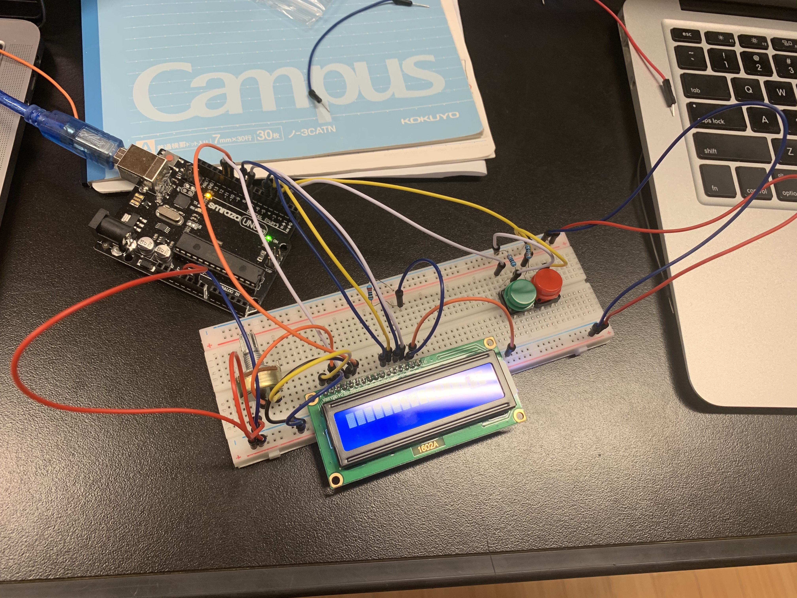

# Unit2-ComSci

### Evaluate and compare bash and arduino ###
Arduino can be worked by a program and apply it to actual circuit.
Comparing to bash, bash is mainly used to create an app or system in computer whereas arduino is mainly used to create a product with circuit such as mobile battery and temprature sensor.
Both programs are basically easy for begginers but arduino requires circuit.

**11/11 Reflection**
Today basically I learned how to make a code in Arduino. For example, how to use "void" and set the valuable.
I felt bit difficult to code because Arduino is more focused on applying on real circuit. 

``` int redLED = 13;```
define valuable redLED as 13 in Arduino

**11/13 Reflection**
Today I made the system which counts binary with LEDs in groups and I learned how to use %
And also I learned how to convert decimal to binary, binary to decimal as homework.
Steps shows how to convert binary to decimal


**11/17 Reflection**
Today I learned how to show the diagram of logicgate, make equation from the graph and make true table for them.  I felt this is one of the hardest topic that I have leaned in Comsci class so it took long time to understand how it works.


*CODE for OR gate*
```
int but1 = 13;
int but2 = 12;
int out1 = 3;
int out2 =4;

int stateA = 0, stateB =0,

void setup()
{
  pinmode(but1, INPUT);
  pinmode(but2, INPUT);
  pinmode(out1, OUTPUT);
  pinmode(out2, OUTPUT);
}
void loop()
{
  stateA = digitalRead(but1);
  stateB = digitalRead(but2);
  if(stateA || stateB){
    digitalWrite(out2, HIGH);
  }else{
    digitalWrite(out2, LOW);
  }
}
```
*CODE for EX-OR gate*
```
int but1 = 13;
int but2 = 12;
int out1 = 3;
int out2 = 4;

int state A =0, stateB = 0,

void setup()
{
  pinmode(but1, INPUT);
  pinmode(but2, INPUT);
  pinmode(out1, OUTPUT);
  pinmode(out2, OUTPUT);
}
void loop()
{
  stateA = digitalRead(but1);
  stateB = digitalRead(but2);
  if((!stateA && sttateB) || (stateA && stateB)){
    digitalWrite(out2, HIGH);
  }else{
    digitalWrite(out2, LOW);
  }
}
```
*CODE for EX-NOR*
```
int but1 = 13;
int but2 = 12;
int out1 = 3;
int out2 = 4;

int stateA = 0, stateB = 0,

void setup()
{
  pinmode(but1, INPUT);
  pinmode(but2, INPUT);
  pinmode(out1, OUTPUT);
  pinmode(out2, OUTPUT);
}
void loop()
{
  stateA = digitalRead(but1);
  stateB = digitalRead(but2);
  if((!stateA && !stateB) || (stateA && stateB)){
    digitalWrite(out1, HIGH);
  }else{
    digitalWrite(out1, LOW);
  }
}
```


**11/19 Reflection**
Today I worked on the system shows 0 to 7 with 7 LEDs in Arduino. And I finally got how true table and equation actually work.
I had a lot of fun making the system because the topic is really familiar with me and pretty easy to understand.
Table shows 7 segments converted from decimal


**11/20 Reflection**
Today I started off by watching a video about HCD. I didn't know that there are many kinds of design and there are many ways to make a good impacts on users.                    
**What is usability?**
The definition of "usability" is
```
Extent to which a product can be used
```
And also it should meet the standard which is ISO 9241-11

**what is HCD?**
```
HCD stands for "Human Centered Design" which means not making product based on itself or technology but 
rather making product based on the needs of users.

4 steps compose HCD Process
1. RESERCH
  Reserch the usage stats and clarify them
2. ANALYZE
  Analyze the needs of the users and clarify them
3. CREATE
  Create some solutions which meet their needs
4. EVALUATE
  Evaluate the solutions which made in third process 
```
**DISCOVERABILITY**
```
is a prime component when you make a good design. 
If the product interact with users, you have to consider "discoverablity". 
Discoverability is a design which is focused on making users aware of 
"what is happening", "what happened" and "what is able to be done"
```
**FEEDBACK**
```
FEEDBACK is a important factor of discoverability because 
it is a indicator to make users notice if it works as users did 
by giving some reactions.
```
**11/22 Reflection**
Today I started to work on the system which converts 2 buttons to English. And I came up with a idea that shows the table below. In order to make the system available, I need to know how to count how many times I pushed and create the table which contains a to z and number 1 to 9 and "delete" and "enter".

Basically, number which is on a vertical line shows times you pushed butA and number which is horizontal line shows times you pushed butB. For example, if you push butA twice and butB once, it shows "A"

I wrote the sample code Dr.Pinzon explained below for the table system
```
int col = 3;
int row = 3;
int indexRow = 0;
int indexCol = 0;
String keyboard[row][col] = {
  {"e", "t", "a"},
  {"0", "9", "x"},
  {"DL", "ST", "OK"}
}

void setup()
{
  pinmode(13, OUTPUT);
  Serial.begin(9600);
  attachInterruption(0, buttonApressed, RISING);
}

void loop()
{
Serial.println("Selected letter is: "+keyboard[indexRow][indexCol]);
}
//This function changes the row in the keyboard
void buttonApressed(){
  indexRow++;
//check for the max row number
if(indexRow>0){
  indexRow=0; //loop back to first row
  ```
 
 **11/25 Reflection**
 Today I learned variety of data types and how to convert hexadecimal to binary
 ```
 DATA TYPES
 char(8bit): signed number from -128 to 127
 unsigned char(8bit): unsigned number from 0 to 255
 int(16bit): signed number from -32768 to 32767
 unsigned int(16bit): unsigned number from 0 to 65535
 long(32bit): signed number from -2,147,483,648 to 2,147,483,647
 unsigned long(32bit): unsigned number from 0 to -4,294,967,295
 boolean(8bit): simple logical true/false
 float(32bit): signed number from -3.4028235E38 to 3.4028235E38
 ```
 **How to convert hexadecimal to binary**
 
 *SETP1*
 Write down the hex number. If there are any, change the hex values represented by letters to their decimal equivalents.
 
 *STEP2*
 Each hex digit represents four binary digits and therefore is equal to a power of 2. The rightmost digit equals to 2^0(1), the next one equals to2^1(2), the next one eqauls to 2^2(4) and the leftmost one equals to 2^3(8). Write these numbers(8, 4, 2 and 1)below the hex values.
 
*STEP3*
Determine which powers of two(8, 4, 2 or 1)sum up to your hex digits. For example, if one of your hex values is 10, this means 8 and 2 sum up to 10(4 and 1 are not used). If your hex number is 2, only 2 is used; 8, 4 and 1 are not.

*STEP4*
Write down 1 below those 8, 4, 2 and 1's that are used. Write down 0 below those that are not used.

*STEP5*
Read the 1's and 0's from left to right to get the binary equivalent of the given hex number.

**What is byte and bit?**
Bit stands for BINARY DIGITS which is the smallest unit of data in a computer. A bit has single binary value, either 1 or 0.
```
8 bits = 1 byte
```

### PROTOCOLS ###
**HTTP**
Stands for: hypertext transfer protocol
Used: it is used by the World Wide Web and defines how messages are formatted and transmitted.


Unit2 MARS PROJECT
==================

A systems conmunicating between Earth, Moon and Mars

Contents
-----------
  1. [Planning](#planning)
  1. [Design](#design)
  1. [Development](#development)
  1. [Manuals](#manuals)
  1. [Evaluation](#evaluation)
  
Planning
------------
**Defining the problem**

We are going to create systems that allows users cammunicating between Earth, Moon and Mars. Keitaro, Lauricenia and I are in charge of Mars part. The system should work with lights to send and get messages. And also the message should be conveyed by binary.

### Solution proposed 
We decided to use Arduino for this project because Arduino allows us to implement scripts with actual buttons, screens and light so that it is possible to send and get messages.

### Success Criteria
1. User can type Alphabets in LCD 
1. Alphabets user typed is converted into Binary
1. Lights works based on binary converted from alphabets user typed
1. Binary is converted into Alphabets
1. Each process is simple and easy for users

Design
-------------

***Flow chart for English Input System***

I can't upload the pic so can you jump from Unit-2 ComSci and pic is uploaded there. Sorry...

***Flow chart for English to Binary System***
I can't upload the pic so can you jump from Unit-2 ComSci and pic is uploaded there. Sorry...

***Flow chart for Binary to English System***
I can't upload the pic so can you jump from Unit-2 ComSci and pic is uploaded there. Sorry...

Development
-------------

***11/27 Reflection***

Today, I started off by making a group(earth, moon, mars) and make a actual system which converts binary to English.
We assigned our works and Uzay and I were in charge of making arduino. We struggled to connect the parts to base because we have never tried to connect lcd.


***Coding "English Input System"***

We first focused on English Input System which allows users to type Alphabet in LCD and send it to "English to Binary system". Keitaro was mainly in charge of this program. The first program which uses two rows. One is to show alphabet A to Z, numbers and other one is to show which alphabet or numbers user picked. 

Code for "English Input System"
```
// include the library code:
#include <LiquidCrystal.h>
int index = 0; 
// add all the letters and digits to the keyboard
String keyboard[]={"SENT", "DEL", "SPACE", "A", "B", "C", "D", "E", "F", "G", "H", "I", "J", "K", "L", "M", "N", "O", "P", "Q", "R", "S", "T", "U", "V", "W", "X", "Y", "Z", "0", "1", "2", "3", "4", "5", "6", "7", "8", "9", };

int numOptions = 39; //size of keyboard

String text = "";//variable to store input


// initialize the library with the numbers of the interface pins
LiquidCrystal lcd(12, 11, 5, 4, 9, 8);

void setup() {
  // set up the LCD's number of columns and rows:
  lcd.begin(16, 2);
  // Print a message to the LCD.
  attachInterrupt(0, changeLetter, RISING);//button A in port 2
  attachInterrupt(1, selected, RISING);//button B in port 3
}

void loop() {
  //start lcd
  // set the cursor to column 0, line 1
  // (note: line 1 is the second row, since counting begins with 0):
  lcd.clear();
  lcd.setCursor(0, 0);
  //print keyboard option
  lcd.print(keyboard[index]);
  lcd.setCursor(0, 1);
  //print input
  lcd.print(text);
  delay(100);
}

//This function changes the letter in the keyboard
void changeLetter(){
  //debouce button
  static unsigned long last_interrupt_time = 0;
  unsigned long interrupt_time = millis();
  if (interrupt_time - last_interrupt_time > 200)
  {
  
    last_interrupt_time = interrupt_time;// If interrupts come faster than 200ms
    index++;
      //check for the max row number
    if(index==numOptions){
      index=0; //loop back to first row
    } 
 }
}

//this function adds the letter to the text or send the msg
void selected(){
  static unsigned long last_interrupt_time = 0;
  unsigned long interrupt_time = millis();
  if (interrupt_time - last_interrupt_time > 200)
  {
  
    last_interrupt_time = interrupt_time;// If interrupts come faster than 200ms
    
    String key = keyboard[index];
    //if DEL is selected, the last character stored in the "text" variable is deleted
    if (key == "DEL")
    {
      int len = text.length();
      text.remove(len-1);
    }
    //if SENT is selected, the "text" variable is emptied
    else if(key == "SENT")
    {
      text="";
    }
    //if SPACE is selected, a space is added to the "text" variable
    else if(key == "SPACE")
    { 
      text += " ";
    }
    //if any othe roption(characters and numbers) are selected, they are stored to the "text" variable
    else{
      text+= key;
    }
    //after any option is selected, the program loops back to the first option
    index = 0; 
  }
  
  
}
```

***Coding "English to Binary"***

We secondly focused on the system which converts English to Binary. It reads the alphabets users typed in "English Input System" and converts them into Binary to turn the light on and off. Lauricenia was mainly in charge of this program. We were going to reffer to ASCII for table which converts English to Binary but we ended up making our own binary numbers.  

Code for "English to Binary system"
```
String engtext= "THIS IS A TEST";
int lightBulb1=6;
int lightBulb2=7;
char toconvert;

void setup()
{
  Serial.begin(9600);
  pinMode(lightBulb1,OUTPUT);
  pinMode(lightBulb2,OUTPUT);
}

void loop()
{
  //separate the message in characters
  for ( int n=0; n < engtext.length(); n++)
  {
   toconvert= engtext.charAt(n);
    Serial.println(toconvert); 
    //send character to engtobin function to convert it to binary
     engTobin(toconvert);
  }
  digitalWrite(lightBulb2, LOW);
  delay(2000);
  digitalWrite(lightBulb1, HIGH);
  digitalWrite(lightBulb2, HIGH);
  delay(100);
  digitalWrite(lightBulb1, LOW);
  digitalWrite(lightBulb2, LOW);
  
  
  while(1)
  {
    //stop loop 
  }
}
//function to convert the character into binary
void engTobin(char x)
{
  switch(toconvert)
  {
    //every character has a binary representation
    case 'A':
      Serial.println("000001");
      binToLightBulb("000001");
      break;
    case 'B':
      Serial.println("000010");
      binToLightBulb("000010");
      break;
    case 'C':
      Serial.println("000011");
      binToLightBulb("000011");
      break;
    case 'D':
      Serial.println("000100");
      binToLightBulb("000100");
      break;
    case 'E':
      Serial.println("000101");
      binToLightBulb("000101");
      break;
    case 'F':
      Serial.println("000110");
      binToLightBulb("000110");
      break;
    case 'G':
      Serial.println("000111");
      binToLightBulb("000111");
      break;
    case 'H':
      Serial.println("001000");
      binToLightBulb("001000");
      break;
    case 'I':
      Serial.println("001001");
      binToLightBulb("001001");
      break;
    case 'J':
      Serial.println("001010");
      binToLightBulb("001010");
      break;
    case 'K':
      Serial.println("001011");
      binToLightBulb("001011");
      break;
    case 'L':
      Serial.println("001100");
      binToLightBulb("001100");
      break;
    case 'M':
      Serial.println("001101");
      binToLightBulb("001101");
      break;
    case 'N':
      Serial.println("001110");
      binToLightBulb("001110");
      break;
    case 'O':
      Serial.println("001111");
      binToLightBulb("001111");
      break;
    case 'P':
      Serial.println("010000");
      binToLightBulb("010000");
      break;
    case 'Q':
      Serial.println("010001");
      binToLightBulb("010001");
      break;
    case 'R':
      Serial.println("010010");
      binToLightBulb("010010");
      break;
    case 'S':
      Serial.println("010011");
      binToLightBulb("010011");
      break;
    case 'T':
      Serial.println("010100");
      binToLightBulb("010100");
      break;
    case 'U':
      Serial.println("010101");
      binToLightBulb("010101");
      break;
    case 'V':
      Serial.println("010110");
      binToLightBulb("000010");
      break;
    case 'W':
      Serial.println("010111");
      binToLightBulb("010111");
      break;
    case 'X':
      Serial.println("011000");
      binToLightBulb("011000");
      break;
    case 'Y':
      Serial.println("011001");
      binToLightBulb("011001");
      break;
     case 'Z':
      Serial.println("011010");
      binToLightBulb("011010");
      break; 
    case '1':
      Serial.println("011011");
      binToLightBulb("011011");
      break;
    case '2':
      Serial.println("011100");
      binToLightBulb("011100");
      break; 
    case '3':
      Serial.println("011101");
      binToLightBulb("011101");
      break; 
    case '4':
      Serial.println("011110");
      binToLightBulb("011110");
      break; 
    case '5':
      Serial.println("011111");
      binToLightBulb("011111");
      break; 
    case '6':
      Serial.println("100000");
      binToLightBulb("100000");
      break;
    case '7':
      Serial.println("100001");
      binToLightBulb("100001");
      break;
    case '8':
      Serial.println("100010");
      binToLightBulb("100010");
      break; 
     case '9':
      Serial.println("100011");
      binToLightBulb("100011");
      break;
     case '0':
      Serial.println("100100");
      binToLightBulb("100100");
      break;
      case ' ':
      Serial.println("100101");
      binToLightBulb("100101");
      break; 
    default:
      digitalWrite(lightBulb1, LOW);
    
    
  }
    
}

//show binary through lamps 
void binToLightBulb(char x[]){
 
  for(int i=0; i < 6;i++){
    //this is the clock, ON
    digitalWrite(lightBulb1,HIGH);
    
    //read one bit of the msg
    char bit = x[i];
    Serial.println(bit);
    
    //when binary equals 0 turn lamp on(buzzers work the opposite way);
    if (bit=='0'){
      digitalWrite(lightBulb2, HIGH);
    }else{
      digitalWrite(lightBulb2, LOW);
    }
    //wait a second
    delay(1000);
    //turn off CLOCK
    digitalWrite(lightBulb1,LOW);
    delay(1000);
  }
  
}
```

**Coding for "Binary to English" System**
We finally focused on "Binary to English System" which converts Binary to English.
Users look at the light that shows the message from moon and if the light is on, it is  counted as 1 and the light is off, it is counted as 0. And the system allows users to get alphabet if the binary read from lights are typed by them. I was mainly in charge of this program. This is basically opposite of the "English to Binary system" as the same table which converts English and binary is used.

Code for "Binary to English system"
```
// include the library code:
#include <LiquidCrystal.h>
int index = 0; 
// add all options to the keyboard
String keyboard[]={"SEND","DEL", "0", "1"};

int numOptions = 4; //size of keyboard

String bin = ""; //where the binary will be stored(input) in string data format

long int todecode; //binary number in int data format

int bidigit; //digit of the binary number

int decimal; //decimal representation of the binary number

int i; //iteration

String text;
// initialize the library with the numbers of the interface pins
LiquidCrystal lcd(12, 11, 5, 4, 9, 8);

void setup() {
  // set up the LCD's number of columns and rows:
  lcd.begin(16, 2);
  Serial.begin(9600);
  //set interrupts
  attachInterrupt(0, changeLetter, RISING);//button A in port 2
  attachInterrupt(1, selected, RISING);//button B in port 3
}

void loop() {
  
  // (note: line 1 is the second row, since counting begins with 0):
  //clear lcd
  lcd.clear();
  //set the cursor to column 0, line 0 and print keyboard option
  lcd.setCursor(0, 0);
  lcd.print(keyboard[index]);
  //set the cursor to column 6, line 1 and print binary input message
  lcd.setCursor(6, 0);
  lcd.print(bin);
  //set the cursor to column 0, line 1 and print the text converted from binary input 
  lcd.setCursor(0, 1);
  lcd.print(text);
  
  delay(100);
}

//This function changes the keyboard option
void changeLetter(){
  //debouce function
  static unsigned long last_interrupt_time = 0;
  unsigned long interrupt_time = millis();
 
  if (interrupt_time - last_interrupt_time > 200)
  {
  
    last_interrupt_time = interrupt_time;// If interrupts come faster than 200ms, assum
    index++;
      //check for the max row number
    if(index==numOptions){
      index=0; //loop back to first row
    } 
 }
}

//this function adds the letter to the text or send the msg
void selected(){
 //debounce function
  static unsigned long last_interrupt_time = 0;
  unsigned long interrupt_time = millis();
  if (interrupt_time - last_interrupt_time > 200)
  {
  
    last_interrupt_time = interrupt_time;// If interrupts come faster than 200ms
    
    String key = keyboard[index];
    //if DEL is selected, the last character stored in the "bin" variable is deleted
    if (key == "DEL")
    {
      int len = text.length();
      text.remove(len-1);
    }
    //if SENT is selected, the binary is converted to decimal
    else if(key == "SEND")
    {
      todecode = bin.toInt();
      while (todecode > 0) {
        remainder = todecode % 10;
          
        bidigit = decimal + bidigit * ( 0.5 + pow(2,i) );
        
        todecode = todecode / 10;
        i++;
      }
      Serial.println(decimal);
      //The decimal is sent to the bintoeng function
      bintoeng(decimal);
      //the input is set to empty again
      bin = " ";
      //restart all the variables in the conversion process
      decimal=0;
      i=0;
      delay(100); 
    }
    ////if any of the numbers are selected, they are stored to the "bin" variable
    else{
      bin+= key;
    }
    index = 0; //restart the index
  }
  
  
}

//function to convert decimal to character
void bintoeng(int sum){
  //each decimal represent a binary that represents a character
  switch(sum){
  case 1:
    Serial.println("A");
    text += "A";
    break;
  case 2:
    Serial.println("B");
    text += "B";  
    break;
  case 3:
    Serial.println("C");
    text += "C";  
    break;
  case 4:
    Serial.println("D");
    text += "D";
    break;
  case 5:
    Serial.println("E");
    text += "E";  
    break;
  case 6:
    Serial.println("F");
    text += "F"; 
    break;
  case 7:
    Serial.println("G");
    text += "G";
    break;
  case 8:
    Serial.println("H");
    text += "H";  
    break;
  case 9:
    Serial.println("I");
    text += "I";
    break;
  case 10:
    Serial.println("J");
    text += "J"; 
    break;
  case 11:
    Serial.println("K");
    text += "K";
    break;
  case 12:
    Serial.println("L");
    text += "L"; 
    break;
  case 13:
    Serial.println("M");
    text += "M"; 
    break;
  case 14:
    Serial.println("N");
    text += "N";
    break;
  case 15:
    Serial.println("O");
    text += "O";
    break;
  case 16:
    Serial.println("P");
    text += "P";
    break;
  case 17:
    Serial.println("Q");
    text += "Q";
     break;
  case 18:
    Serial.println("R");
    text += "R";
     bin = " ";
    break;
  case 19:
    Serial.println("S");
    text += "S";
    break;
  case 20:
    Serial.println("T");
    text += "T";
    break;
  case 21:
    Serial.println("U");
    text += "U";
    break;
  case 22:
    Serial.println("V");
    text += "V";
     bin = " ";
    break;
  case 23:
    Serial.println("W");
    text += "W"; 
    break;
  case 24:
    Serial.println("X");
    text += "X";
    break;
  case 25:
    Serial.println("Y");
    text += "Y"; 
    break;
  case 26:
    Serial.println("Z");
    text += "Z";
    break;
  case 27:
    Serial.println("1");
    text += "1";
    break;
  case 28:
    Serial.println("2");
    text += "2"; 
    break;
  case 29:
    Serial.println("3");
    text += "3";
    break;
  case 30:
    Serial.println("4");
    text += "4";
    break;
  case 31:
    Serial.println("5");
    text += "5";
    break;
  case 32:
    Serial.println("6");
    text += "6";
    break;
  case 33:
    Serial.println("7");
    text += "7";
    break;
  case 34:
    Serial.println("8");
    text += "8";
    break;
  case 35:
    Serial.println("9");
    text += "9";
    break;
  case 36:
    Serial.println("0");
    text += "0";
    break;
  case 37:
    Serial.println(" ");
    text += " ";
    break;
  }
}
```
 
Manuals
-----------
**English to Binary**

This is the manual of how to use our “English to binary” arduino.

This program has 2 input buttons with color blue and red.
With 2 output light that shows binary code.

By pressing the blue button, you can scroll through the options. 
Options are “send” “del” “space” “a” “b”.....”z”
When you accidentally pass through the option you want to select, you have to start the loop again to scroll.

By pressing the red button you can select the options. You cursor is on “send” option and press red button, the program will send the text you inputted.

After you send the text you inputted, the output light will blink. This will show the text you typed in binary code.

One light will blink on a regular basis, this light is used as counter. This will blink to show the knot of the code.

Other light will blink to show the binary code.
For example, “A” is “000001” in binary. This case the light will pause first 5 blink of the counter clock and blink once for the last count.

**Binary to English**

This is the manual of how to use our “binary to English” arduino.

This program has 2 blue and red input buttons. 
With output LCD screen attached to bread board.

Blue input button is used to scroll down the options. By pressing the button you can go forward to scroll through the options in the program “send” “del” “0” “1”. 

Red button is used to select the options.
By selecting “000001” and press “send” you can express the binary code in to English.

When you miss type your code during the selection, first you have to send the code and delete it to restart typing it.

Ex. You wanted to type “000001” but you missed “001”.  In this case, you have to first “send” the miss typed code. And then press “del” to delete the text.

After sending the binary code, English ver should be shown on to LCD screen. 
So basically after user inputted their code, output should be shown automatically.

Ex. “000001” “send” -> “A”


Evaluation
-----------
**TEST 1   English input and converting to binary**

・ check if the LCD displays options clicked by users by the left button

・ type "THIS IS A TEST" by clicking the right button

・ Choose "SLECT" and check if the signals from lights are corresponding to binary converted by alphabets

**TEST 2   Binary input and converting to English**

・ check if the LCD displays options clicked by users by the left button

・ Type the binary converted from alphabets in previous system

・ check if the LCD displays the message "THIS IS A TEST" corresponding to binary which is previously entered 


