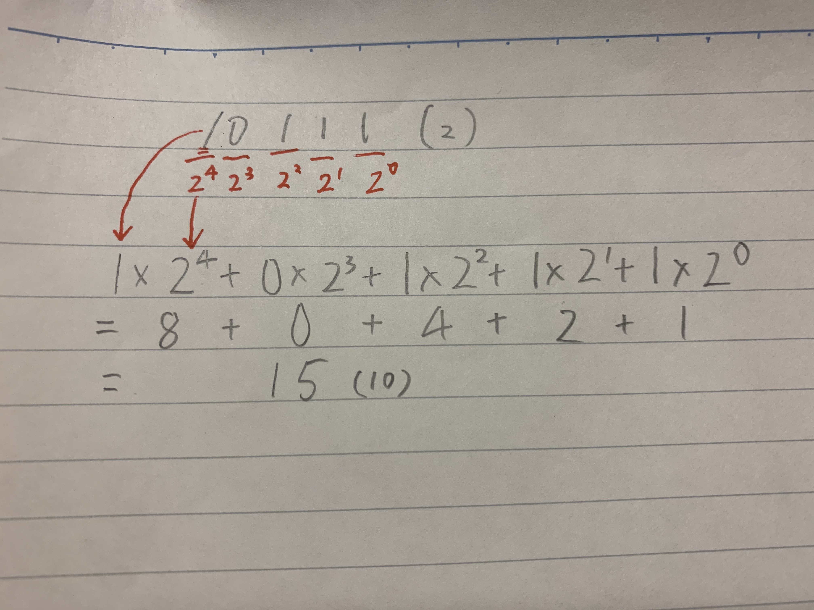

# Unit2-ComSci

### Evaluate and compare bash and arduino ###
Arduino can be worked by a program and apply it to actual circuit.
Comparing to bash, bash is mainly used to create an app or system in computer whereas arduino is mainly used to create a product with circuit such as mobile battery and temprature sensor.
Both programs are basically easy for begginers but arduino requires circuit.

**11/11 Reflection**
Today basically I learned how to make a code in Arduino. For example, how to use "void" and set the valuable.
I felt bit difficult to code because Arduino is more focused on applying on real circuit. 

``` int redLED = 13;```
define valuable redLED as 13 in Arduino

**11/13 Reflection**
Today I made the system which counts binary with LEDs in groups and I learned how to use %
And also I learned how to convert decimal to binary, binary to decimal as homework.
Steps shows how to convert binary to decimal


**11/17 Reflection**
Today I learned how to show the diagram of logicgate, make equation from the graph and make true table for them.  I felt this is one of the hardest topic that I have leaned in Comsci class so it took long time to understand how it works.


*CODE for OR gate*
```
int but1 = 13;
int but2 = 12;
int out1 = 3;
int out2 =4;

int stateA = 0, stateB =0,

void setup()
{
  pinmode(but1, INPUT);
  pinmode(but2, INPUT);
  pinmode(out1, OUTPUT);
  pinmode(out2, OUTPUT);
}
void loop()
{
  stateA = digitalRead(but1);
  stateB = digitalRead(but2);
  if(stateA || stateB){
    digitalWrite(out2, HIGH);
  }else{
    digitalWrite(out2, LOW);
  }
}
```
*CODE for EX-OR gate*
```
int but1 = 13;
int but2 = 12;
int out1 = 3;
int out2 = 4;

int state A =0, stateB = 0,

void setup()
{
  pinmode(but1, INPUT);
  pinmode(but2, INPUT);
  pinmode(out1, OUTPUT);
  pinmode(out2, OUTPUT);
}
void loop()
{
  stateA = digitalRead(but1);
  stateB = digitalRead(but2);
  if((!stateA && sttateB) || (stateA && stateB)){
    digitalWrite(out2, HIGH);
  }else{
    digitalWrite(out2, LOW);
  }
}
```
*CODE for EX-NOR*
```
int but1 = 13;
int but2 = 12;
int out1 = 3;
int out2 = 4;

int stateA = 0, stateB = 0,

void setup()
{
  pinmode(but1, INPUT);
  pinmode(but2, INPUT);
  pinmode(out1, OUTPUT);
  pinmode(out2, OUTPUT);
}
void loop()
{
  stateA = digitalRead(but1);
  stateB = digitalRead(but2);
  if((!stateA && !stateB) || (stateA && stateB)){
    digitalWrite(out1, HIGH);
  }else{
    digitalWrite(out1, LOW);
  }
}
```


**11/19 Reflection**
Today I worked on the system shows 0 to 7 with 7 LEDs in Arduino. And I finally got how truw table and equation actually work.
I had a lot of fun making the system because the topic is really familiar with me and pretty easy to understand.
Table shows 7 segments converted from decimal


**What is usability?**
The definition of "usability" is
```
Extent to which a product can be used
```
And also it should meet the standard which is ISO 9241-11

**what is HCD?**


feedback
discoverability
YouTube "It's not bad doors are everywhere"

What is the volatile data type in Arduino


